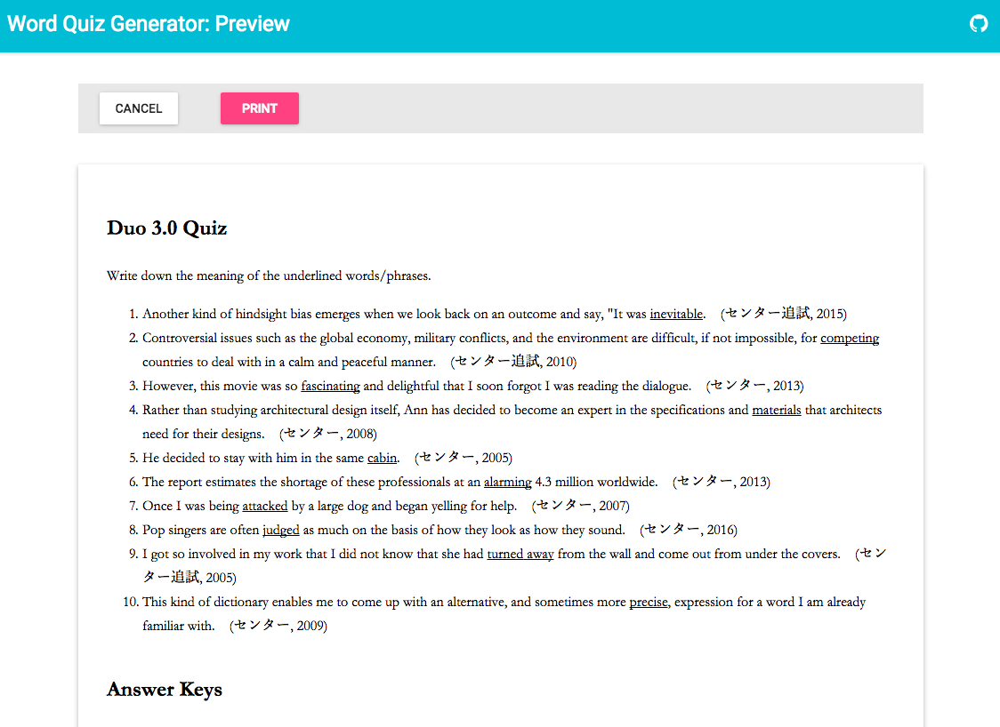

# Online Word Quiz Generator



Once you specify a test material, Word Quiz Generator then retrieves a sentence which includes one of the word/phrase in the material from existing sources, and creates a write-the-definition type of exam.

## Launch
This is a NodeJS application. You need to have the latest version of Node.js.

```sh
$ npm run start
```

## Resources

The lists of materials, sources and presets the application uses are defined in resources.json, which is located on the root of this repository as default.

If you want to change the path, please specify a new path with environment variable like

```sh
$ export RESOURCES=/path/to/resources.json
```

### Materials

The materials are a CSV-formatted list of words/phrases to be tested.

```
{
  "id": "duo",
  "name": "Duo 3.0",
  "lang": "en",
  "sections": "1-45",
  "path": "../data/materials/duo.csv"
}
```

where __id__ is an unique identity, __name__ is a material's name which will be shown in the material list on the app, __lang__ is an language name and must be one of the [IETF language tags](http://unicode.org/cldr/utility/languageid.jsp), __sections__ is the number of sections the material has, and __path__ is a relative path to the material from resources.json.

For details of the content of a CSV file, please see [word-quiz-generator repo](https://github.com/nodaguti/word-quiz-generator).

### Sources

The sources are a text which will be used on generating a question sentence.

```
{
  "id": "university-of-tokyo-entrance-examination-english",
  "name": "Entrance Exam of University of Tokyo (English, 2005)",
  "lang": "en",
  "path": "../data/sources/en/tokyo/"
}
```

where __id__ is an unique identity, __name__ is a source's name which will be shown in the sources list on the app, __lang__ is an language name and must be one of the [IETF language tags](http://unicode.org/cldr/utility/languageid.jsp), and path is a relative path to the material from resources.json.

The app can use a preprocessed text and a lemmatized text to improve the quality of searching a word/phrase. For details please see [word-quiz-generator repo](https://github.com/nodaguti/word-quiz-generator).

### Presets

The presets are predefined Advanced section settings.
